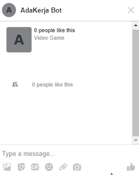

# Messenger Chatbot



## Description
This is a simple messenger chatbot built in Node.js. This bot utilizes store.js library to store sessions and all messages data. This means this bot has no persistence layer as all data is stored in runtime memory.

## Setup
1. Clone this git repository to your development environment.
2. Install all dependencies by executing `npm install`.
3. Rename (or copy) .env.example file into .env (Tips: You can do this by executing `cp .env.example .env`).<br>This file contains port number in which the bot will be served, and both verify token and access token for the webhook.
4. Test the bot by entering the command `npm run test`.
5. Deploy the bot into a server, or by tunneling your localhost (e.g. via ngrok). Run the bot by executing `node index.js`. Make sure your bot is accessible using https.
6. Bind your webhook into a facebook app and page. Please refer to https://developers.facebook.com/docs/messenger-platform/getting-started/app-setup on how to bind it. You will have to set `VERIFY_TOKEN` and `ACCESS_TOKEN` accordingly in the .env file.
7. The bot now is functional and ready to accept messages from the user.

## Endpoints
There are several endpoints that are served on this app.

### /webhook
This endpoint is used exclusively to bind this app into Facebook Messenger. You might not want to touch this.

### /messages
This endpoint is used to manage messages received by the bot.

#### GET /messages
This will return all stored messages.

#### GET /messages/{messageId}
This will return a message with the specified `{messageId}`.

#### POST /messages/delete
Body:
```
{
    messageId: {messageId}
}
```
This will delete a message entry with the specified `{messageId}`.